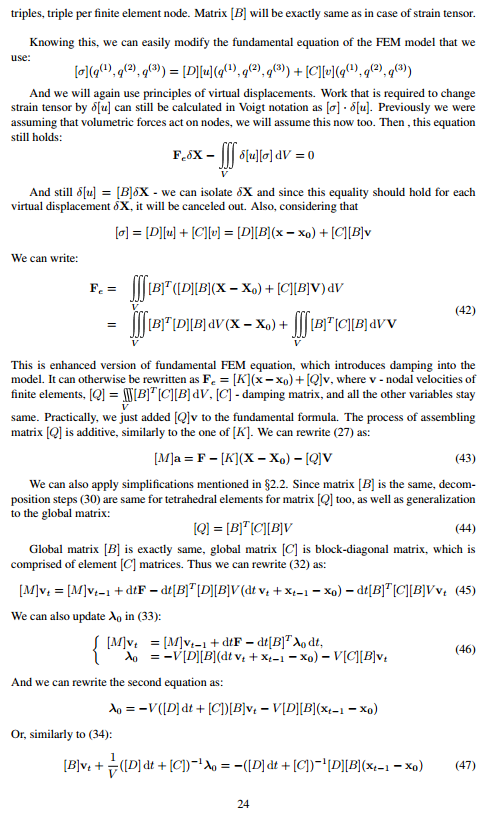
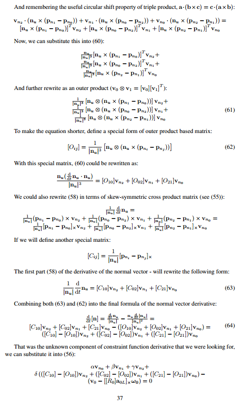
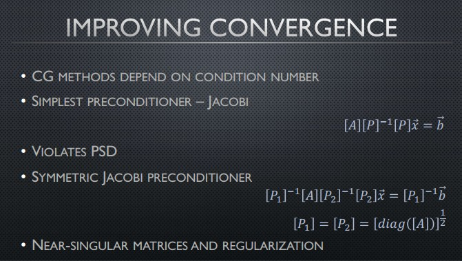
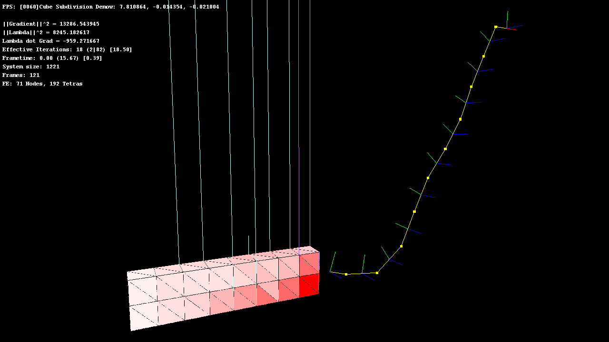

# Coupled FEM and constrained rigid body simulation
Old (2008/2009) research project, collaboration of **F. Benevolenski** and **A. Voroshilov**.

## Description
Project aimed to research possibilities to couple corotational Finite Element based elastoplastic deformable bodies and articulated rigid bodies dynamics. Coupling is achieved via representing FEs as a form of additional joints, thus allowing simulating the whole system in a single simulation loop. Rigid bodies are represented as a pair of quadruplets - one linear and one rotational, while pure FE joints act on linear quadruplets, and combined joints act on pair of quadruplets (rigid body) and several linear quadruplets (FE nodes).

Classic articulated rigid bodies simulation is fueled by Projected Gauss Seidel solver, but convergence characteristics of this method are insufficient in most situations. To achieve better convergence results, Conjugate Gradient based MLCP solver was developed, based on the previous work of Z. Dostál. In addition to better convergence results, the implemented method is also inherently parallel (like CG cousin), and this assumption was validated with CUDA-accelerated implementation, although it is not included in the current release due to the fact that CUDA code is heavily outdated.

[Paper](materials/fem_paper.pdf), describing the full approach (both coupling and MLCP solver) is included, along with high-level [presentation](materials/fem_presentation.pdf). Please note that **neither was peer-reviewed**, so any constructive feedback is appreciated.

 

## Demo
Solution contains several projects, main demo project for the coupled simulation is called `cuda_femdemo` (despite the name, this release doesn't contain CUDA code), scene selection is via `TEST_PRESET` preprocessor switch. Solver selection is via `SOFTWARE_SOLVER` preprocessor switch (please note, that `HARDWARE_SOLVER` must be set to `HW_SOLVER_NONE` in this release). `gjkdemo` project visualizes GJK distance algorithm, although it is not directly related to the project, as it is incomplete and not integrated into the main simulation flow.

This is `TEST_FEMBOX_CHAIN` scene of `cuda_femdemo`. Chain is composed of conventional rigid bodies, connected with spherical joints (each RGB basis represents body, yellow are spherical joint links). The chain is connected to a FEM body with a hybrid FEM-rigid spherical joint. FEM body rests on the plane with friction, after falling down with non-zero horizontal velocity.

## Framework description
**Key** implemented functions include:
1. Tetrahedral operations to validate supplied tetrahedral mesh
2. Joints:
    1. Purely FE joints calculations, corotational FEM, elastic and plastic deformations
    2. Hybrid FE-rigid body joint calculations
    3. Limited set of rigid body joints, spherical joint and contact joint with pyramidal friction
3. Solvers:
    1. Classic Projected Gauss Seidel
    2. Conjugate Gradient solver - validation solver that only capable of handling linear systems (i.e. no friction, sticky contacts)
    3. CG MLCP solver - capable of solving MLCPs, have better convergence characteristics than PGS, convenient for parallelization; CUDA version was implemented but **not included in this release**
    4. Dantzig direct solver - sample implementation, **not integrated into the FEM simulation**
    5. Lemke direct solver - sample implementation, **not integrated into the FEM simulation**
4. General maths:
    1. Sylvester criterion calculation - to validate matrix structure, and aid in regularization research
    2. Gilbert-Johnson-Keerthi distance algorithm, was planned to be eventually integrated, but didn't quite get there. Doesn't handle interpenetration, i.e. no Expanding Polytope Algorithm.
    3. A lot of supplementary maths included, like matrices, interpolations, etc.
5. OpenGL rendering frontend

## Parallelization and GPU acceleration
We actually implemented CUDA-accelerated solver at some, to test the theory that the CG-based solver could benefit heavily from the GPU acceleration. However, it was back in the CC1.1 era, and now the code is very much outdated and ineffective (for example, lacks intra-warp communication, doesn't use bindless textures, etc.), thus it was cut in the initial public release; but this fact explains some of the framework design decision, e.g. data layout, and function logic flow - the code was meant to be conveniently compatible with both CPU and GPU versions of the solvers.

Important note on the GPU implementation of the solver: one iteration of the solver requires several global syncs due to the data relations, and complicated scenes often require hundreds of iterations. So key aspect for achieving high performance was the introduction of manually crafted global barriers, which didn't require CUDA kernel invocations. As a consequence, this added the requirement of predictable (static) scheduling, and hence tuning schedule configuration for each and every future generation of GPUs to achieve maximum device utilization. But this allowed to cut down kernel launch overheads.

## Performance and details of implementation
Available in the [paper](materials/fem_paper.pdf) and [presentation](materials/fem_presentation.pdf) - but be aware that measurements were not renewed, hence the data comes from quite old hardware, namely Intel Core i7-920 and NVIDIA GTX260.

## Acknowledgments
Although our research was conducted independently, it was later discovered that *M. Servin et al* conducted similar research; our contribution, however, includes developing CG-based MLCP solver based on the work of *Z. Dostál*, and is also a little different on the implementation level.

Our work is also based on contributions from *M. Müller et al*, and *J. F. O'Brien*.

Full list of references could be found in the provided paper.

## License
[Creative Commons Attribution-NonCommercial-ShareAlike 4.0 International Public License](https://creativecommons.org/licenses/by-nc-sa/4.0/legalcode)
